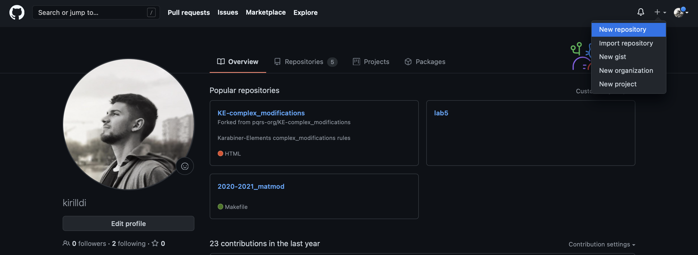
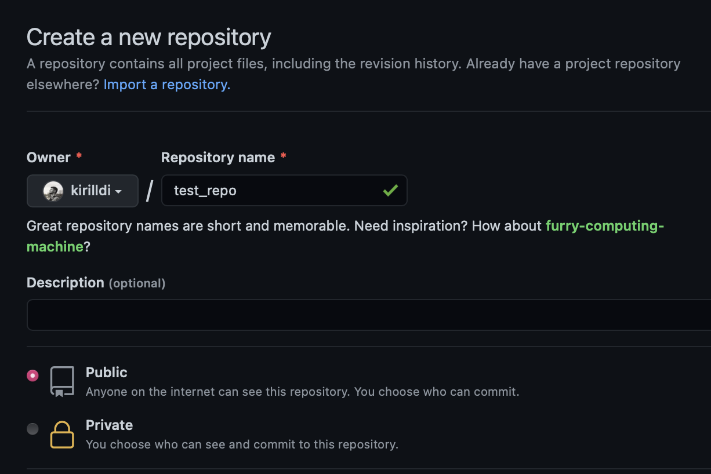
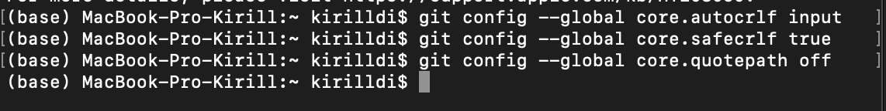
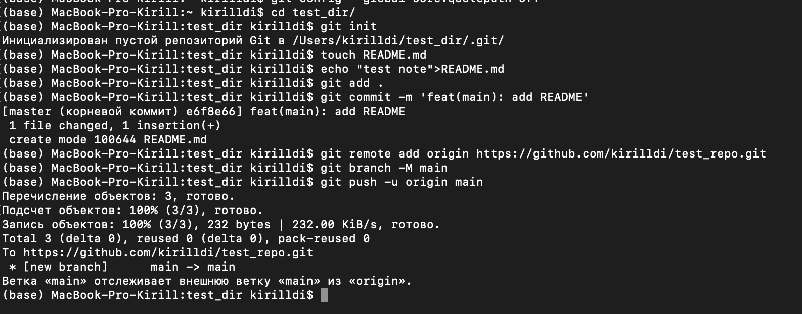
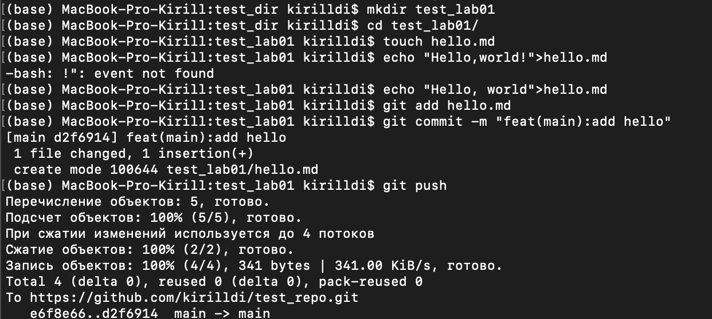
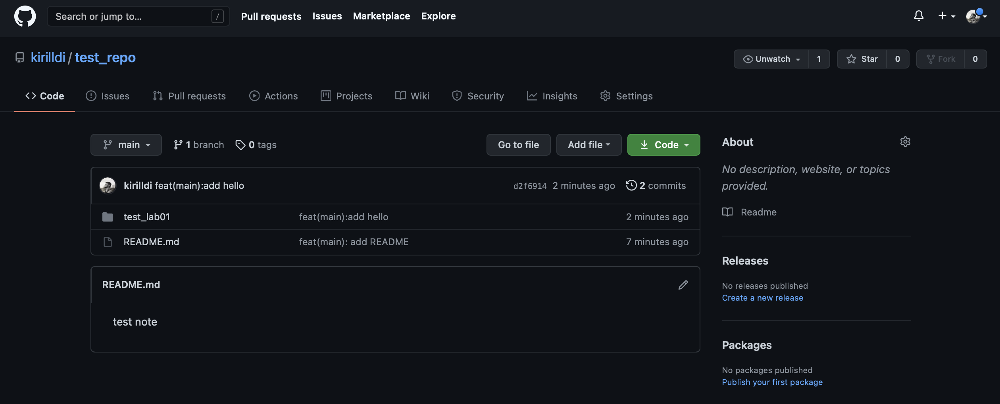

---
## Front matter
lang: ru-RU
title: Лабораторная работа №1
author: Дидусь К.В.
		Группа НКНбд-01-18
date: 31.03.2021

## Formatting
toc: false
slide_level: 2
theme: metropolis
header-includes: 
 - \metroset{progressbar=frametitle,sectionpage=progressbar,numbering=fraction}
 - '\makeatletter'
 - '\beamer@ignorenonframefalse'
 - '\makeatother'
aspectratio: 43
section-titles: true
---

# Прагматика выполнения лабораторной работы 

- Git невероятно полезный и популярный инструмент
- Стандартное решения для контролья версий

## Цель работы

Научиться создавать репозитории в github, использовать Git Bash, загружать файлы и папки на GitHub с помощью Git Bash.

## Задание

- Создать репозиторий
- Первичная настройка Git Bash
- Создать git-репозиторий из каталога на компьютере
- Создать каталог и файл и дать commit
- Загрузить на GitHub

# Выполнение лабораторной работы

## Создание репозитория

{ #fig:001 width=70% }

## Создание репозитория

{ #fig:002 width=70% }

## Первичная настройка Git Bash

{ #fig:003 width=70% }

## Создание git-репозитория из каталога на компьютере.

{ #fig:004 width=70% }

## Создание каталога и файла

{ #fig:005 width=70% }

## Загрузка на GitHub

{ #fig:006 width=70% }

## {.standout}

Научился создавать репозитории в github, использовать Git Bash, загружать файлы и папки на GitHub с помощью Git Bash.