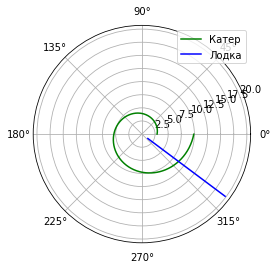
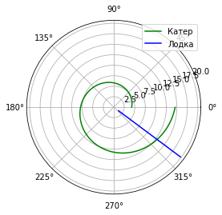

---
## Front matter
lang: ru-RU
title: Лабораторная работа №2 - Задача о погоне
author: Дидусь К.В.
		Группа НКНбд-01-18
date: 2.04.2021

## Formatting
toc: false
slide_level: 2
theme: metropolis
header-includes: 
 - \metroset{progressbar=frametitle,sectionpage=progressbar,numbering=fraction}
 - '\makeatletter'
 - '\beamer@ignorenonframefalse'
 - '\makeatother'
aspectratio: 43
section-titles: true
---

## Прагматика выполнения лабораторной работы 

- Изучение основ математического моделирования.
- Умение строить траектории движения в теории и визуализировать их.

## Цель выполнения лабораторной работы

- Научиться решать задачу о погоне;
- Построить графики траектории движения;
- Вывести уравнение, описывающее движение.

## Задачи выполнения лабораторной работы

- Записать уравнение, описывающее движение катера, с начальными условиями для двух случаев (в зависимости от расположения катера относительно лодки в начальный момент времени).
- Постройте траекторию движения катера и лодки для двух случаев.
- Найдите точку пересечения траектории катера и лодки 

## Результаты выполнения программы

{ #fig:001 width=70% }

## Результаты выполнения программы

{ #fig:002 width=70% }

## {.standout}

-Ознакомился с формулировкой задачи о погоне. Нашел ее решение и визуализировал траектории движения на графике.