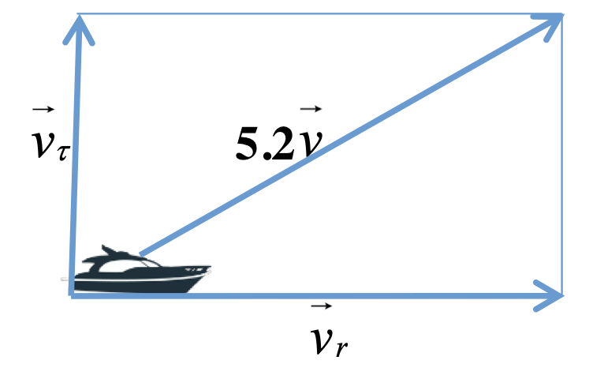
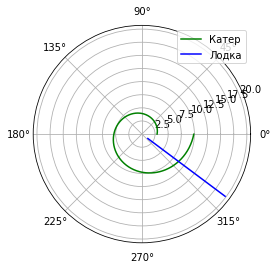
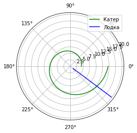

---
# Front matter
lang: ru-RU
title: "Лабораторная работа №2"
subtitle: "Задача о погоне"
author: "Дидусь К.В."

# Formatting
toc-title: "Содержание"
toc: true # Table of contents
toc_depth: 2
lof: true # List of figures
lot: true # List of tables
fontsize: 12pt
linestretch: 1.5
papersize: a4paper
documentclass: scrreprt
polyglossia-lang: russian
polyglossia-otherlangs: english
mainfont: PT Serif
romanfont: PT Serif
sansfont: PT Sans
monofont: PT Mono
mainfontoptions: Ligatures=TeX
romanfontoptions: Ligatures=TeX
sansfontoptions: Ligatures=TeX,Scale=MatchLowercase
monofontoptions: Scale=MatchLowercase
indent: true
pdf-engine: lualatex
header-includes:
  - \linepenalty=10 # the penalty added to the badness of each line within a paragraph (no associated penalty node) Increasing the value makes tex try to have fewer lines in the paragraph.
  - \interlinepenalty=0 # value of the penalty (node) added after each line of a paragraph.
  - \hyphenpenalty=50 # the penalty for line breaking at an automatically inserted hyphen
  - \exhyphenpenalty=50 # the penalty for line breaking at an explicit hyphen
  - \binoppenalty=700 # the penalty for breaking a line at a binary operator
  - \relpenalty=500 # the penalty for breaking a line at a relation
  - \clubpenalty=150 # extra penalty for breaking after first line of a paragraph
  - \widowpenalty=150 # extra penalty for breaking before last line of a paragraph
  - \displaywidowpenalty=50 # extra penalty for breaking before last line before a display math
  - \brokenpenalty=100 # extra penalty for page breaking after a hyphenated line
  - \predisplaypenalty=10000 # penalty for breaking before a display
  - \postdisplaypenalty=0 # penalty for breaking after a display
  - \floatingpenalty = 20000 # penalty for splitting an insertion (can only be split footnote in standard LaTeX)
  - \raggedbottom # or \flushbottom
  - \usepackage{float} # keep figures where there are in the text
  - \floatplacement{figure}{H} # keep figures where there are in the text
---

# Цель работы

Ознакомиться с задачей о погоне. Научиться  ее решать  строить графики траектории движения, выводить уравнение, описывающее движение.

# Выполнение лабораторной работы

## Постановка задачи

1. Место нахождения лодки браконьеров в момент обнаружения: $t_0 = 0, x_{л0} = 0$
. Место нахождения катера береговой охраны относительно лодки браконьеров в момент обнаружения лодки: $x_{к0} = 0$

2. Введем полярные координаты. Считаем, что полюс - это точка обнаружения лодки браконьеров $x_{л0} (0 = x_{л0} = 0)$
, а полярная ось r проходит через точку нахождения катера береговой охраны 

3. Траектория катера должна быть такой, чтобы и катер, и лодка все время были на одном расстоянии от полюса, только в этом случае траектория катера пересечется с траекторией лодки. Поэтому для начала катер береговой охраны должен двигаться некоторое время прямолинейно, пока не окажется на том же расстоянии от полюса, что и лодка браконьеров. После этого катер береговой охраны должен двигаться вокруг полюса удаляясь от него с той же скоростью, что и лодка браконьеров.


4. Чтобы найти расстояние $X$ (расстояние, после которого катер начнет двигаться вокруг полюса), необходимо составить простое уравнение. Пусть через время t катер и лодка окажутся на одном расстоянии $x$ от полюса. За это время лодка пройдет $x$, а катер — $k - x$ (или $k + x$ в зависимости от начального положения катера относительно полюса). Время, за которое они пройдут это расстояние, вычисляется как $x/v$ или ${k-x}/3.9v$ (во втором случае ${k+x}/3.9v$). Так как время одно и то же, то эти величины одинаковы. Тогда неизвестное расстояние $x$ можно найти из следующего уравнения:
$$ \frac{x}{v} = \frac{k-x}{5.2v}\ в\ первом \ случае$$
или
$$ \frac{x}{v} = \frac{k+x}{5.2v}\ во\ втором.$$

Отсюда мы найдем два значения $x_1 = \frac{k}{6.2}$ и $x_2 = \frac{k}{4.2}$ 
, задачу будем решать для двух случаев.


5. После того, как катер береговой охраны окажется на одном расстоянии от полюса, что и лодка, он должен сменить прямолинейную траекторию и начать двигаться вокруг полюса, удаляясь от него со скоростью лодки $v$. Для этого скорость катера раскладываем на две составляющие: $v_r$ — радиальная скорость и $v_{\tau}$ — тангенциальная скорость . Радиальная скорость - это скорость, с которой катер удаляется от полюса, $v_r = \frac{dr}{dt}$. Нам нужно, чтобы эта скорость была равна скорости лодки, поэтому полагаем $\frac{dr}{dt}=v$.

Тангенциальная скорость – это линейная скорость вращения катера относительно полюса. Она равна произведению угловой скорости $\frac{\partial \theta}{\partial t}$ на радиус $r,\ v_{\tau} = r \frac{\partial \theta}{\partial t}$

Из рисунка (рис. -@fig:002) видно: $v_{\tau} = \sqrt{27.04v^2 - v^2} = \sqrt{26.04}v$ (учитывая, что радиальная скорость равна $v$). Тогда получаем $r \frac{\partial \theta}{\partial t} = \sqrt{26.04}v$

{ #fig:000 width=70% }

6. Решение исходной задачи сводится к решению системы из двух дифференциальных уравнений: 

\begin{equation*} 
  \begin{cases} 
    \frac{\partial r}{\partial t} = v 
    \\
    r \frac{\partial \theta}{\partial t} = \sqrt{26.04} v 
  \end{cases}
\end{equation*} 

с начальными условиями 

\begin{equation*}
  \begin{cases}
    \theta_0 = 0 
    \\ 
    r_0 = x_1 
  \end{cases}
\end{equation*}

\begin{equation*}
  \begin{cases}
    \theta_0 = -\pi
    \\
    r_0 = x_2
  \end{cases}
\end{equation*} 

Исключая из полученной системы производную по $t$, можно перейти к следующему уравнению:
$$ \frac{\partial r}{\partial \theta} = \frac{r}{\sqrt{26.04}}.$$
Начальные условия остаются прежними. Решив это уравнение, мы получим траекторию движения катера в полярных координатах.

# Код программы

Приведу полный код программы (Python):    
Разработка велась в среде Spyder

```
import math
import numpy as np
from scipy.integrate import odeint
import matplotlib.pyplot as plt

t = np.arange(0, 15, 1)

k = 17.9 # Растояние между катером и лодкой
fi = 3*math.pi/4 # Направление лодки
tang_vel = 5.2**2-1 # Тангенциальная скорость

# Движение катера
def dr(r, tetha): 
    dr = r/math.sqrt(tang_vel)
    return dr

#
def tetha(v, tetha0):
    r0 = k/v
    tetha = np.arange(tetha0, 2*math.pi, 0.01)
    r = odeint(dr, r0, tetha)
    return r0, tetha, r

# Движение лодки
def f2(t): 
    xt=math.tan(fi)*t
    return xt

def plot(tetha, r, tetha2, r2):
    plt.figure(1)
    plt.polar(tetha, r, 'g')
    plt.polar(tetha2, r2, 'b')
    plt.legend(['Катер', 'Лодка'])


ll = t*t + f2(t)*f2(t)
r2 = np.sqrt(ll)
tetha2 = (np.tan(f2(t)/t))**(-1)

r0, tetha, r = tetha(4.2, 0)
plot(tetha, r, tetha2, r2)
```
# Результаты выполнения

Случай первый (рис. -@fig:001)

{ #fig:001 width=70% }

Случай второй (рис. -@fig:002)

{ #fig:002 width=70% }


# Выводы

Ознакомился c задачей о погоне и нашел ее решение