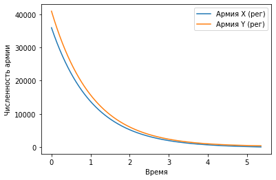
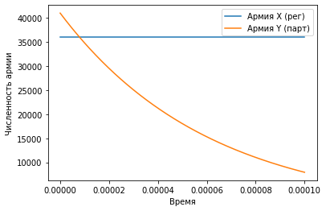

---
## Front matter
lang: ru-RU
title: Лабораторная работа №3 - Модель боевых действий
author: Дидусь К.В.
		Группа НКНбд-01-18
date: 31.03.2021

## Formatting
toc: false
slide_level: 2
theme: metropolis
header-includes: 
 - \metroset{progressbar=frametitle,sectionpage=progressbar,numbering=fraction}
 - '\makeatletter'
 - '\beamer@ignorenonframefalse'
 - '\makeatother'
aspectratio: 43
section-titles: true
---

## Прагматика выполнения лабораторной работы 

Модель боевых действий позволяет оценить шансы на победу в битве, до ее начала. Получив примерный исход сражения, можно уверенно наступать, либо изменить стратегию и избежать битвы, в обоих сохраняя боевые ресурсы. 
Модель рассматривая в этой лабораторной не применима в реальных противостояниях ввиду ее простоты, но она позволит ознакомится с общими принципами задачи.

## Задачи выполнения лабораторной работы
Построить графики изменения численности армии для двух случаев:
	- военные действия между двумя регулярными войсками;
	- военные действия между регулярным войском и партзанами. 

## Результаты выполнения программы

{ #fig:001 width=70% }

## Результаты выполнения программы

{ #fig:002 width=70% }

## {.standout}

Рассмотрел  модель боевых действий — модель Ланчестера.