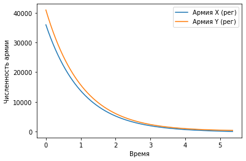
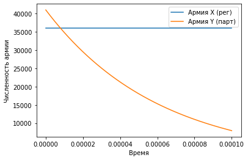

---
# Front matter
lang: ru-RU
title: "Лабораторная работа №3"
subtitle: "Модель боевых действий"
author: "Дидусь К.В."

# Formatting
toc-title: "Содержание"
toc: true # Table of contents
toc_depth: 2
lof: true # List of figures
lot: true # List of tables
fontsize: 12pt
linestretch: 1.5
papersize: a4paper
documentclass: scrreprt
polyglossia-lang: russian
polyglossia-otherlangs: english
mainfont: PT Serif
romanfont: PT Serif
sansfont: PT Sans
monofont: PT Mono
mainfontoptions: Ligatures=TeX
romanfontoptions: Ligatures=TeX
sansfontoptions: Ligatures=TeX,Scale=MatchLowercase
monofontoptions: Scale=MatchLowercase
indent: true
pdf-engine: lualatex
header-includes:
  - \linepenalty=10 # the penalty added to the badness of each line within a paragraph (no associated penalty node) Increasing the value makes tex try to have fewer lines in the paragraph.
  - \interlinepenalty=0 # value of the penalty (node) added after each line of a paragraph.
  - \hyphenpenalty=50 # the penalty for line breaking at an automatically inserted hyphen
  - \exhyphenpenalty=50 # the penalty for line breaking at an explicit hyphen
  - \binoppenalty=700 # the penalty for breaking a line at a binary operator
  - \relpenalty=500 # the penalty for breaking a line at a relation
  - \clubpenalty=150 # extra penalty for breaking after first line of a paragraph
  - \widowpenalty=150 # extra penalty for breaking before last line of a paragraph
  - \displaywidowpenalty=50 # extra penalty for breaking before last line before a display math
  - \brokenpenalty=100 # extra penalty for page breaking after a hyphenated line
  - \predisplaypenalty=10000 # penalty for breaking before a display
  - \postdisplaypenalty=0 # penalty for breaking after a display
  - \floatingpenalty = 20000 # penalty for splitting an insertion (can only be split footnote in standard LaTeX)
  - \raggedbottom # or \flushbottom
  - \usepackage{float} # keep figures where there are in the text
  - \floatplacement{figure}{H} # keep figures where there are in the text
---

# Цель работы

- Рассмотреть простейшую модель боевых действий - модель Ланчестера:

# Задание

1. Составить системы дифференциальных уравнений изменения численностей армий;
2. Построить график развития боевых действий между двумя регулярными армиями;
3. Построить график развития боевых действий между регулярной армией и отрядами партизан;

## Условие

Между страной Х и страной У идет война. Численность состава войск исчисляется от начала войны, и являются временными функциями
$x(t)$ и $y(t)$. В начальный момент времени страна Х имеет армию численностью 12 000 человек, а в распоряжении страны У армия численностью в 15 000 человек. Для упрощения модели считаем, что коэффициенты $a,b,c,h$ постоянны. Также считаем $P(t)$ и $Q(t)$ непрерывные функции.

Постройте графики изменения численности войск армии Х и армии У для следующих случаев:

Между регулярными войсками:
$$ \frac{\partial x}{\partial t} = -0.12x(t) - 0.74y(t) + sin(t+1)+2$$
$$ \frac{\partial y}{\partial t} = -0.49x(t) - 0.53y(t) + cos(t+2)+2$$

Между регулярными и партизанами:
$$ \frac{\partial x}{\partial t} = -0.47x(t) - 0.654y(t) + 1,5|sin(2t)|$$
$$ \frac{\partial y}{\partial t} = -0.31x(t)y(t) - 0.38y(t) + 2|cos(t)|$$

# Выполнение лабораторной работы

## Код программы

Приведу полный код программы (Python):    

```
import numpy as np
from scipy.integrate import odeint
import matplotlib.pyplot as plt

x0 = 36010 #численность армии Х
y0 = 41000 #численность армии Y

# Между регулярными:
a1 = 0.12 #константа, характеризующая степень влияния различных факторов на потери
b1 = 0.74 #эффективность боевых действий армии у
c1 = 0.49 #эффективность боевых действий армии х
h1 = 0.53 #константа, характеризующая степень влияния различных факторов на потери

# Между регулярными и партизанами:
a2 = 0.47 #константа, характеризующая степень влияния различных факторов на потери
b2 = 0.654 #эффективность боевых действий армии у
c2 = 0.456 #эффективность боевых действий армии х
h2 = 0.39 #константа, характеризующая степень влияния различных факторов на потери

# время
t = np.arange(0,0.0001, 0.0000001)

# Первый случай
def P1(t):
    p1 = np.sin(t+1) + 2
    return p1
def Q1(t):
    q1 = np.cos(t+2) + 2
    return q1

# Второй случай
def P2(t):
    p2 = 1.5 * abs(np.sin(2*t))
    return p2
def Q2(t):
    q2 = 2 * abs(np.cos(t))
    return q2

# Изменения численности

# Первый случай (2 регулярные армии)
def S1(f, t):
    s11 = -a1*f[0] - b1*f[1] + P1(t)
    s12 = -c1*f[0] - h1*f[1] + Q1(t)
    return s11, s12

#Второй случай (1 регулярная армия против армии партизан)
def S2(f, t):
    s21 = -a2*f[0] - b2*f[1] + P2(t)
    s22 = -c2*f[0]*f[1] - h2*f[1] + Q2(t)
    return s21, s22

v = np.array([x0, y0]) # Начальные условий (Численность)

# Решение
f1 = odeint(S1, v, t)
f2 = odeint(S2, v, t)

"""
# Первый случай (две регулярные армии)
plt.plot(t, f1)
plt.ylabel('Численность армии')
plt.xlabel('Время')
plt.legend(['Армия X (рег)', 'Армия Y (рег)'])

"""
# Второй случай (регулярная армия и партизаны)
plt.plot(t, f2)
plt.ylabel('Численность армии')
plt.xlabel('Время')
plt.legend(['Армия X (рег)', 'Армия Y (парт)'])
```

## Результат выполнения

График первого случая (рис. -@fig:001)

{ #fig:001 width=70% }

График второго случая (рис. -@fig:002)

{ #fig:002 width=70% }

# Выводы

Рассмотрел простейшую модель боевых действий – модель Ланчестера. Научился составлять системы дифференциальных уравнений изменения численностей армии и строить графики для моделей боевых действий.  