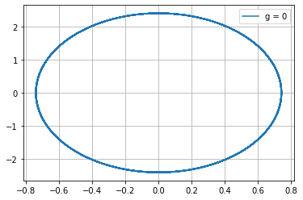
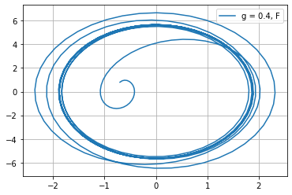

---
## Front matter
lang: ru-RU
title: Лабораторная работа №4 - Модель гармонических колебаний
author: Дидусь К.В.
		Группа НКНбд-01-18
date: 2.04.2021

## Formatting
toc: false
slide_level: 2
theme: metropolis
header-includes: 
 - \metroset{progressbar=frametitle,sectionpage=progressbar,numbering=fraction}
 - '\makeatletter'
 - '\beamer@ignorenonframefalse'
 - '\makeatother'
aspectratio: 43
section-titles: true
---

## Прагматика выполнения лабораторной работы

- Очень часто малые колебания, как свободные, так и вынужденные, которые происходят в реальных системах, можно считать имеющими форму гармонических колебаний или очень близкую к ней. 

- Для широкого класса систем откликом на гармоническое воздействие является гармоническое колебание. С учётом предыдущего свойства это позволяет исследовать прохождение колебаний произвольной формы через системы.

# Цель выполнения лабораторной работы

## Цель выполнения лабораторной работы

- Освоить понятия: 
	- гармонические колебания;
	- осциллятор;
	- фазовый портрет. 

# Задачи выполнения лабораторной работы

## Задачи выполнения лабораторной работы

- Построить фазовый портрет гармонического осциллятора и решить уравнения гармонического осциллятора для следующих случаев:
	- Колебания гармонического осциллятора без затуханий и без действий внешней силы
	- Колебания гармонического осциллятора c затуханием и без действий внешней силы
	- Колебания гармонического осциллятора c затуханием и под действием внешней силы 

	На заданном интервале с заданными начальными условиями.

# Результаты выполнения лабораторной работы

## Переход от дифференциального уравнения второго порядка к двум дифференциальным уравнениям первого порядка

Пусть у нас есть дифференциальное уравнение 2-го порядка:
$$ \ddot {x} + w_0^2x = f(t) $$

Для перехода к системе уравнений первого порядка сделаем замену:
$$ y = \dot{x} $$

Тогда получим систему уравнений:
   $$ \begin{cases} y = \dot{x} \\ \dot{y} = - w_0^2x \end{cases}$$

# Результаты выполнения

## Результаты выполнения

{ #fig:001 width=70% }

## Результаты выполнения

{ #fig:002 width=70% }

## Результаты выполнения

{ #fig:003 width=70% }

## Результаты выполнения

{ #fig:004 width=70% }

## {.standout}

- Освоил понятия: 
	- гармонические колебания;
	- осциллятор;
	- фазовый портрет.