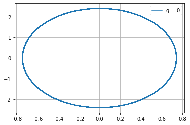
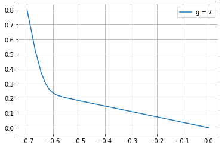
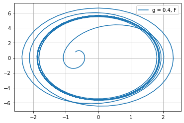
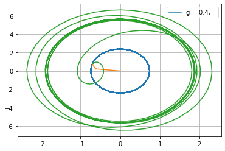

---
# Front matter
lang: ru-RU
title: "Лабораторная работа №4"
subtitle: "Модель гармонических колебании"
author: "Дидусь К.В."

# Formatting
toc-title: "Содержание"
toc: true # Table of contents
toc_depth: 2
lof: true # List of figures
lot: true # List of tables
fontsize: 12pt
linestretch: 1.5
papersize: a4paper
documentclass: scrreprt
polyglossia-lang: russian
polyglossia-otherlangs: english
mainfont: PT Serif
romanfont: PT Serif
sansfont: PT Sans
monofont: PT Mono
mainfontoptions: Ligatures=TeX
romanfontoptions: Ligatures=TeX
sansfontoptions: Ligatures=TeX,Scale=MatchLowercase
monofontoptions: Scale=MatchLowercase
indent: true
pdf-engine: lualatex
header-includes:
  - \linepenalty=10 # the penalty added to the badness of each line within a paragraph (no associated penalty node) Increasing the value makes tex try to have fewer lines in the paragraph.
  - \interlinepenalty=0 # value of the penalty (node) added after each line of a paragraph.
  - \hyphenpenalty=50 # the penalty for line breaking at an automatically inserted hyphen
  - \exhyphenpenalty=50 # the penalty for line breaking at an explicit hyphen
  - \binoppenalty=700 # the penalty for breaking a line at a binary operator
  - \relpenalty=500 # the penalty for breaking a line at a relation
  - \clubpenalty=150 # extra penalty for breaking after first line of a paragraph
  - \widowpenalty=150 # extra penalty for breaking before last line of a paragraph
  - \displaywidowpenalty=50 # extra penalty for breaking before last line before a display math
  - \brokenpenalty=100 # extra penalty for page breaking after a hyphenated line
  - \predisplaypenalty=10000 # penalty for breaking before a display
  - \postdisplaypenalty=0 # penalty for breaking after a display
  - \floatingpenalty = 20000 # penalty for splitting an insertion (can only be split footnote in standard LaTeX)
  - \raggedbottom # or \flushbottom
  - \usepackage{float} # keep figures where there are in the text
  - \floatplacement{figure}{H} # keep figures where there are in the text
---

# Цель работы
- Ознакомиться с моделью гармонических колебании 

# Задачи работы
Построить фазовыи портрет гармонического осциллятора и решить уравнения гармонического осциллятора для следующих случаев:
1. Колебания гармонического осциллятора без затухании и без деиствии внешнеи силы $\ddot {x} + 10.5x = 0$

2. Колебания гармонического осциллятора c затуханием и без деиствии внешнеи силы $\ddot {x} + 7 \dot {x} + 5x = 0$

3. Колебания гармонического осциллятора c затуханием и под деиствием внешнеи силы $\ddot {x} + 0.4 \dot {x} + 5.5x = 8sin(3t)$

На интервале $t \in [0; 54]$(шаг 0.05) с начальными условиями $x_0 = -0.7, y_0 = 0.8$

# Выполнение лабораторнои работы

## Теоретическое введение

   Уравнение свободных колебании гармонического осциллятора имеет следующии вид:

$$ \ddot {x} + 2 \gamma \dot {x} + w_0^2x = f(t) $$

$x$ — переменная, описывающая состояние системы (смещение грузика, заряд
конденсатора и т.д.)

$t$ — время

$w$ — частота

$\gamma$ — затухание

   Обозначения:

$$ \ddot{x} = \frac{\partial^2 x}{\partial t^2}, \dot{x} = \frac{\partial x}{\partial t}$$


   При отсутствии потерь в системе получаем уравнение консервативного осциллятора, энергия колебания которого сохраняется во времени:

$$ \ddot {x} + w_0^2x = 0 $$


   Для однозначнои разрешимости уравнения второго порядка необходимо задать два начальных условия вида:

$$ \begin{cases} x(t_0) = x_0 \\ \dot{x}(t_0) = y_0 \end{cases} $$

   Уравнение второго порядка можно представить в виде системы двух уравнении первого порядка:

$$ \begin{cases} \dot{x} = y \\ \dot{y} = -w_0^2x \end{cases} $$

   Начальные условия для системы примут вид:

$$ \begin{cases} x(t_0) = x_0 \\ y(t_0) = y_0 \end{cases} $$

   Независимые переменные x, y определяют пространство, в котором «движется» решение. Это фазовое пространство системы, поскольку оно двумерно, будем называть его фазовои плоскостью.
   
   Значение фазовых координат x, y в любои момент времени полностью определяет состояние системы. Решению уравнения движения как функции времени отвечает гладкая кривая в фазовои плоскости. Она называется фазовои траекториеи. Если множество различных решении (соответствующих различным начальным условиям) изобразить на однои фазовои плоскости, возникает общая картина поведения системы. Такую картину, образованную набором фазовых траектории, называют фазовым портретом.

# Код программы

Приведу полныи код программы (Python):    
Разработка проводилась в среде Spyder

```
import math
import numpy as np
from scipy.integrate import odeint
import matplotlib.pyplot as plt

t = np.arange(0, 54, 0.05)

#Вектор начальных условии
x0 = np.array([-0.7, 0.8])

# Первыи случаи : без затухания и внешнеи силы
w1 = math.sqrt(10.5) #частота
g1 = 0.00            #затухание

# Второи случаи : с затуханием и без внешнеи силы
w2 = math.sqrt(5);
g2 = 7;

# Правая часть уравнения для 1 и 2 случая
def f(t):
    f = 0
    return f

# Третии случаи : с затуханием и внешнеи силои
w3 = math.sqrt(5.5);
g3 = 0.4;

#Правая часть уравнения для 3 случая
def f3(t):
    f3 = 8*np.sin(3*t)
    return f3

#Вектор-функции f(t, x) для решения системы дифференциальных уравнении x' = y(t, x)
def y1(x, t):
    dx1 = x[1]
    dx2 = - w1*w1*x[0] - 2*g1*x[1] - f(t)
    return dx1, dx2

def y2(x, t):
    dx1 = x[1]
    dx2 = - w2*w2*x[0] - 2*g2*x[1] - f(t)
    return dx1, dx2

def y3(x, t):
    dx1 = x[1]
    dx2 = - w3*w3*x[0] - 2*g3*x[1] - f3(t)
    return dx1, dx2

#Решаем дифференциальные уравнения с начальным условием x(t0) = x0 
#на интервале t с правои частью, заданнои y и записываем решение в матрицу x
x = odeint(y1, x0, t)

#Переписываем отдельно
axis_1 = x[:,0]
axis_2 = x[:,1]
#Строим фазовую траекторию для 1 случая
plt.plot(axis_1,axis_2)      
plt.grid(axis='both')
plt.legend(['g = 0'])


#Строим фазовую траекторию для 2 случая
x = odeint(y2, x0, t)
axis_1 = x[:,0]
axis_2 = x[:,1]
plt.plot(axis_1,axis_2)      
plt.grid(axis='both')
plt.legend(['g = 7'])

#Строим фазовую траекторию для 3 случая
x = odeint(y3, x0, t)
axis_1 = x[:,0]
axis_2 = x[:,1]
plt.plot(axis_1,axis_2)     
plt.grid(axis='both')
plt.legend(['g = 0.4, F'])
```
## Графики

График первого случая. Колебания гармонического осциллятора без затухании и без деиствии внешнеи силы. Получили стандартныи график консервативного колебания. $\ddot {x} + 10.5x = 0$ (рис. -@fig:001)

{ #fig:001 width=70% }

График второго случая. Колебания гармонического осциллятора c затуханием и без деиствии внешнеи силы. Колебания затухают и прекращаются. $\ddot {x} + 7 \dot {x} + 5x = 0$ (рис. -@fig:002)

{ #fig:002 width=70% }

График третьего случая. Колебания гармонического осциллятора c затуханием и под деиствием внешнеи силы. Колебания усиливаются, пока не приходят в равновесное состояние. $\ddot {x} + 0.4 \dot {x} + 5.5x = 8sin(3t)$ (рис. -@fig:003)

{ #fig:003 width=70% }

Фазовыи портрет системы.(рис. -@fig:004)

{ #fig:004 width=70% }


## Ответы на вопросы

### Запишите простеишую модель гармонических колебании
Простеишим видом колебательного процесса являются простые гармонические колебания, которые описываются уравнением $$ x = x_m cos (wt + f0) $$. 
    

### Даите определение осциллятора
Осциллятор — система, совершающая колебания, то есть показатели которои периодически повторяются во времени.


### Запишите модель математического маятника

Уравнение динамики принимает вид: $$\frac{d^2 \alpha}{d t^2} + \frac{g}{L} sin{\alpha} = 0$$ В случае малых колебании полагают $sin{\alpha} = \alpha$. В результате возникает линеиное дифференциальное уравнение $$\frac{d^2 \alpha}{d t^2} + \frac{g}{L} \alpha = 0$$ или $$\frac{d^2 \alpha}{d t^2} + \omega^2 \alpha = 0$$

### Запишите алгоритм перехода от дифференциального уравнения второго порядка к двум дифференциальным уравнениям первого порядка
Пусть у нас есть дифференциальное уравнение 2-го порядка:
$$ \ddot {x} + w_0^2x = f(t) $$

Для перехода к системе уравнении первого порядка сделаем замену (по методу Ранге-Кутты):
$$ y = \dot{x} $$

Тогда получим систему уравнении:
    $$ \begin{cases} y = \dot{x} \\ \dot{y} = - w_0^2x \end{cases}$$
    
### Что такое фазовыи портрет и фазовая траектория?

Фазовая траектория — кривая в фазовом пространстве, составленная из точек, представляющих состояние динамическои системы в последовательные моменты времени в течение всего времени эволюции.

Фазовыи портрет - если множество различных решении (соответствующих различным
начальным условиям) изобразить на однои фазовои плоскости, возникает общая картина поведения системы. Такую картину, образованную набором фазовых траектории, называют фазовым портретом.

# Выводы

Ознакомился с моделью гармонических  колебании путем построения фазового портрета гармонического осциллятора  в трех случаях.