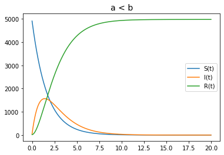

---
## Front matter
lang: ru-RU
title: Лабораторная работа №5
author: Дидусь К.В.	Группа НКНбд-01-18
date: 18.03.2021

## Formatting
toc: false
slide_level: 2
theme: metropolis
header-includes: 
 - \metroset{progressbar=frametitle,sectionpage=progressbar,numbering=fraction}
 - '\makeatletter'
 - '\beamer@ignorenonframefalse'
 - '\makeatother'
aspectratio: 43
section-titles: true
---

# Прагматика выполнения лабораторной работы 

## Прагматика выполнения лабораторной работы 

- Человечество многократно сталкивалась с угрозой эпидемии. Такие болезни как холера, чума, грипп и другие унесли миллиарды жизней.

- Для того чтобы уметь бороться с эпидемиями, т. е. своевременно проводить тот или иной комплекс мероприятий (прививки, вакцины, карантин и т.д.), необходимо уметь оценить эффективность каждого такого комплекса и выбрать наиболее оптимальный для данного вида эпидемии

- Моделирование распространения заболеваний может дать базу для принятия быстрых решений, которые могут уберечь огромное количество людей

# Цель выполнения лабораторной работы

## Цель выполнения лабораторной работы

- Изучить простейшую модель эпидемии SIR

# Задачи выполнения лабораторной работы

## Задачи выполнения лабораторной работы

1. Построить график изменения кол-ва людей в каждой из трех групп для случая I <= I*
2. Построить график изменения кол-ва людей в каждой из трех групп для случая I > I*

# Результаты выполнения лабораторной работы

## Первый случай

{ #fig:001 width=70% }

## Второй случай

{ #fig:002 width=70% }

## Второй случай

{ #fig:002 width=70% }

## {.standout}

Таким образом я познакомился с моделью эпидемии, рассмотрел 2 случая распространения инфекции, а также изучил влияние коэффициентов выздоровления и заболеваемости на скорость распространения инфекции.