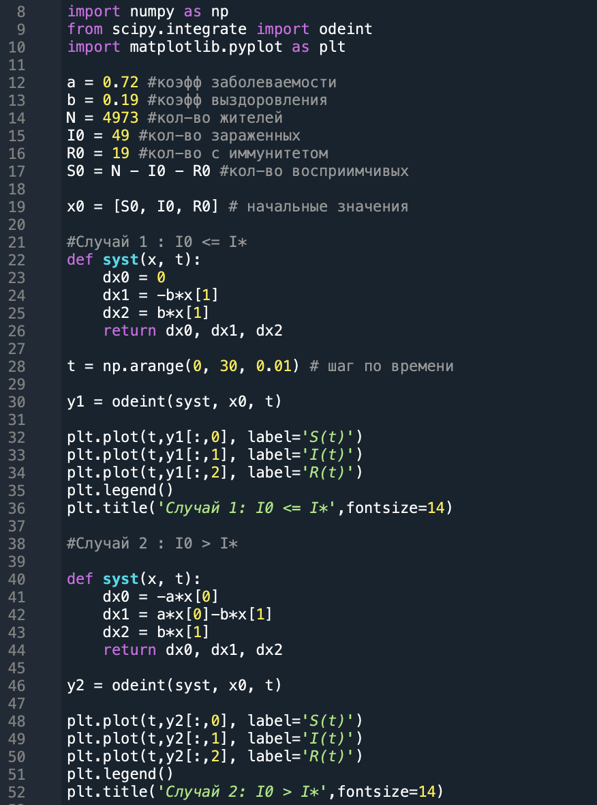
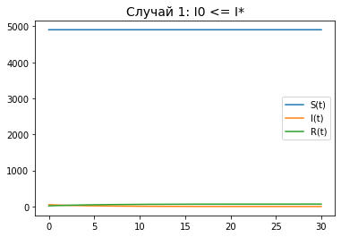
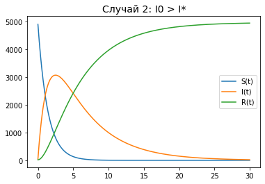

---
# Front matter
lang: ru-RU
title: "Лабораторная работа №5"
subtitle: "Задача об эпидемии"
author: "Дидусь Кирилл Валерьевич"

# Formatting
toc-title: "Содержание"
toc: true # Table of contents
toc_depth: 2
lof: true # List of figures
lot: false # List of tables
fontsize: 12pt
linestretch: 1.5
papersize: a4paper
documentclass: scrreprt
polyglossia-lang: russian
polyglossia-otherlangs: english
mainfont: PT Serif
romanfont: PT Serif
sansfont: PT Sans
monofont: PT Mono
mainfontoptions: Ligatures=TeX
romanfontoptions: Ligatures=TeX
sansfontoptions: Ligatures=TeX,Scale=MatchLowercase
monofontoptions: Scale=MatchLowercase
indent: true
pdf-engine: lualatex
header-includes:
  - \linepenalty=10 # the penalty added to the badness of each line within a paragraph (no associated penalty node) Increasing the value makes tex try to have fewer lines in the paragraph.
  - \interlinepenalty=0 # value of the penalty (node) added after each line of a paragraph.
  - \hyphenpenalty=50 # the penalty for line breaking at an automatically inserted hyphen
  - \exhyphenpenalty=50 # the penalty for line breaking at an explicit hyphen
  - \binoppenalty=700 # the penalty for breaking a line at a binary operator
  - \relpenalty=500 # the penalty for breaking a line at a relation
  - \clubpenalty=150 # extra penalty for breaking after first line of a paragraph
  - \widowpenalty=150 # extra penalty for breaking before last line of a paragraph
  - \displaywidowpenalty=50 # extra penalty for breaking before last line before a display math
  - \brokenpenalty=100 # extra penalty for page breaking after a hyphenated line
  - \predisplaypenalty=10000 # penalty for breaking before a display
  - \postdisplaypenalty=0 # penalty for breaking after a display
  - \floatingpenalty = 20000 # penalty for splitting an insertion (can only be split footnote in standard LaTeX)
  - \raggedbottom # or \flushbottom
  - \usepackage{float} # keep figures where there are in the text
  - \floatplacement{figure}{H} # keep figures where there are in the text
---

# Цель работы
Рассмотреть модель эпидемии. Построить графики иллюстрирующие задачу.

# Задание

1. Построить график изменения кол-ва людей в каждой из трех групп
2. Рассмотреть случай, когда I <= I* 
3.  Рассмотреть случай, когда I > I* 

# Выполнение лабораторной работы

## Теоретическая основа задачи

Предположим, что некая популяция, состоящая из N особей, (считаем, что популяция изолирована) подразделяется на три группы. 

- $S(t)$ — здоровые особи, восприимчивые к заболеванию
- $I(t)$ — инфицированные особи, способные распространять инфекцию
- $R(t)$ — здоровые особи, с иммунитетом к болезни. 

Пока число заболевших не превышает некого критического значения $I^*$ считаем, что все больные изолированы и не заражают здоровых. Когда $I(t)>I^*$,  инфицирование могут заражать восприимчивых к болезни особей.

Таким образом, скорость изменения числа S(t) меняется по следующему закону:

$$ \frac{\partial S}{\partial t} = \begin{cases} - \alpha S, if I(t)>I^* \\ 0, if I(t) \leq I^* \end{cases}$$

Поскольку каждая восприимчивая к болезни особь, которая, в конце концов, заболевает, сама становится инфекционной, то скорость изменения числа инфекционных особей представляет разность за единицу времени между заразившимися и теми, кто уже болеет и лечится, т.е.:

$$ \frac{\partial I}{\partial t} = \begin{cases} - \alpha S - \beta I, if I(t)>I^* \\ - \beta I, if I(t) \leq I^* \end{cases}$$

А скорость изменения выздоравливающих особей (при этом приобретающие иммунитет к болезни):

$$ \frac{\partial R}{\partial t} = \beta I$$

Постоянные пропорциональности:

- $\alpha$ — коэффициент заболеваемости

- $\beta$ — коэффициент выздоровления

Для того, чтобы решения соответствующих уравнений определялось однозначно, необходимо задать начальные условия. Считаем, что на начало эпидемии в момент времени $t = 0$ нет особей с иммунитетом к болезни $R(0)=0$, а число инфицированных и восприимчивых к болезни особей $I(0)$ и $S(0)$ соответственно. Для анализа картины протекания эпидемии необходимо рассмотреть два случая: $I(0) \leq I^*$ и $I(0) > I^*$

## Входные данные
$$N=5 217$$
$$I(0)=74$$
$$R(0)=14$$
$$S(0)=N - I(0) - R(0)$$
$$ \alpha = 0.72 $$
$$ \beta = 0.19 $$

## Реализация
Ниже приведен код программы, реализованный на языке программирования Python (рис 1 -@fig:001)  

{ #fig:001 width=70% }

## Результат работы программы

Ниже представлен график изменения кол-ва людей в каждой группе (S,I,R) для первого случая, когда кол-во зараженных не превышает критического значения. (рис .2 -@fig:001)  

{ #fig:001 width=70% }

Далее представлен график изменения кол-ва людей в каждой группе (S,I,R) для второго случая, когда кол-во зараженных  превышает критическое значение (рис .3 -@fig:001)  

{ #fig:001 width=70% }

# Код программы

Приведу полный код программы (Python):    

```

"""
Created on Thu Mar 18 18:56:15 2021
@author: kirilldi
"""

import numpy as np
from scipy.integrate import odeint
import matplotlib.pyplot as plt

a = 0.72 #коэфф заболеваемости
b = 0.19 #коэфф выздоровления
N = 4973 #кол-во жителей
I0 = 49 #кол-во зараженных
R0 = 19 #кол-во с иммунитетом
S0 = N - I0 - R0 #кол-во восприимчивых

#Случай 1 : I0 <= I*
def syst(x, t):
    dx0 = 0
    dx1 = -b*x[1]
    dx2 = b*x[1]
    return dx0, dx1, dx2

x0 = [S0, I0, R0] # начальные значения

t = np.arange(0, 30, 0.01) # шаг по времени

y1 = odeint(syst, x0, t) 


plt.plot(t,y1[:,0], label='S(t)')
plt.plot(t,y1[:,1], label='I(t)')
plt.plot(t,y1[:,2], label='R(t)')
plt.legend()
plt.title('Случай 1: I0 <= I*',fontsize=14)

#Случай 2 : I0 > I*

def syst(x, t):
    dx0 = -a*x[0]
    dx1 = a*x[0]-b*x[1]
    dx2 = b*x[1]
    return dx0, dx1, dx2


y2 = odeint(syst, x0, t) 

"""
plt.plot(t,y2[:,0], label='S(t)')
plt.plot(t,y2[:,1], label='I(t)')
plt.plot(t,y2[:,2], label='R(t)')
plt.legend()
plt.title('Случай 2: I0 > I*',fontsize=14)
"""
```

# Выводы

Ознакомился с моделью эпидемии. Рассмотрел 2 случая распространения инфекции. Изучил влияние коэффициентов выздоровления и заболеваемости на скорость распространения инфекции.