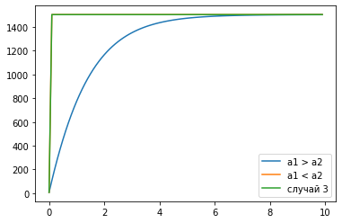

---
## Front matter
lang: ru-RU
title: Лабораторная работа №7
author: Дидусь К.В.	Группа НКНбд-01-18
date: 27.03.2021

## Formatting
toc: false
slide_level: 2
theme: metropolis
header-includes: 
 - \metroset{progressbar=frametitle,sectionpage=progressbar,numbering=fraction}
 - '\makeatletter'
 - '\beamer@ignorenonframefalse'
 - '\makeatother'
aspectratio: 43
section-titles: true
---

# Прагматика выполнения лабораторной работы 

## Прагматика выполнения лабораторной работы 

- Реклама - движущая сила бизнеса. Крайне важно уметь найти наиболее эффективные методы продвижение для успешной продажи продукта или услуги. 

- Моделирование процесса распространения информации позволяет понять как распространяется информация и оценить какой из методов подойдет лучше.

# Цель выполнения лабораторной работы

## Цель выполнения лабораторной работы

- Изучить модель эффективности рекламы

# Задачи выполнения лабораторной работы

## Задачи выполнения лабораторной работы

Постройте график распространения рекламы, математическая модель которой описывается следующим уравнением:

1. $\frac{\partial n}{\partial t} = (0.68 + 0.00009n(t))(N - n(t))$
2. $\frac{\partial n}{\partial t} = (0.00001 + 0.28n(t))(N - n(t))$
3. $\frac{\partial n}{\partial t} = (0.4sin(5t) + 0.4cos(3t)n(t))(N - n(t))$

При условии, что  объем аудитории $N$ = 1505, в начальный момент о товаре знает 7 человек.

## Теория

Математическая модель распространения рекламы описывается уравнением:

$$ \frac{\partial n}{\partial t} = (\alpha_1(t) + \alpha_2(t)n(t))(N - n(t))$$

# Результаты выполнения лабораторной работы

## Графики эффективности рекламы

{ #fig:001 width=70% }

## Графики эффективности рекламы

{ #fig:002 width=70% }

## Вывод

Таким образом я познакомился с моделью эффективности рекламы в разных случаях, а также построил график распространения рекламы. В процессе познакомился с моделью Мальтуса, а также с уравнением логистической кривой.