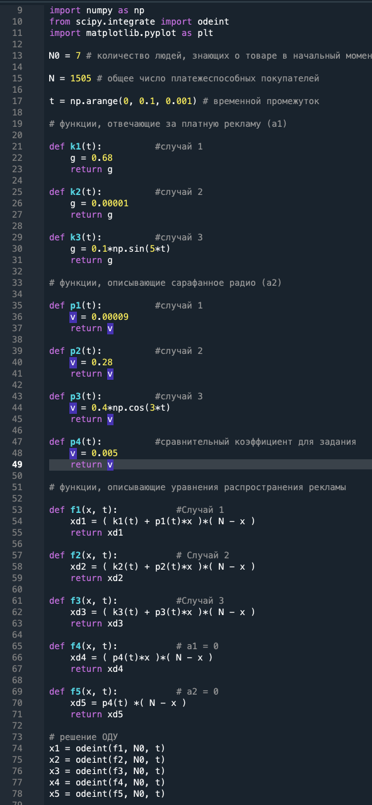
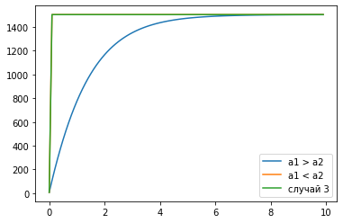
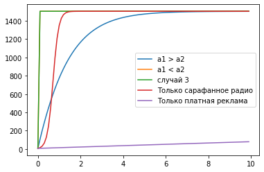

---
# Front matter
lang: ru-RU
title: "Лабораторная работа №7"
subtitle: "Эффективность рекламы"
author: "Дидусь К.В."

# Formatting
toc-title: "Содержание"
toc: true # Table of contents
toc_depth: 2
lof: true # List of figures
lot: true # List of tables
fontsize: 12pt
linestretch: 1.5
papersize: a4paper
documentclass: scrreprt
polyglossia-lang: russian
polyglossia-otherlangs: english
mainfont: PT Serif
romanfont: PT Serif
sansfont: PT Sans
monofont: PT Mono
mainfontoptions: Ligatures=TeX
romanfontoptions: Ligatures=TeX
sansfontoptions: Ligatures=TeX,Scale=MatchLowercase
monofontoptions: Scale=MatchLowercase
indent: true
pdf-engine: lualatex
header-includes:
  - \linepenalty=10 # the penalty added to the badness of each line within a paragraph (no associated penalty node) Increasing the value makes tex try to have fewer lines in the paragraph.
  - \interlinepenalty=0 # value of the penalty (node) added after each line of a paragraph.
  - \hyphenpenalty=50 # the penalty for line breaking at an automatically inserted hyphen
  - \exhyphenpenalty=50 # the penalty for line breaking at an explicit hyphen
  - \binoppenalty=700 # the penalty for breaking a line at a binary operator
  - \relpenalty=500 # the penalty for breaking a line at a relation
  - \clubpenalty=150 # extra penalty for breaking after first line of a paragraph
  - \widowpenalty=150 # extra penalty for breaking before last line of a paragraph
  - \displaywidowpenalty=50 # extra penalty for breaking before last line before a display math
  - \brokenpenalty=100 # extra penalty for page breaking after a hyphenated line
  - \predisplaypenalty=10000 # penalty for breaking before a display
  - \postdisplaypenalty=0 # penalty for breaking after a display
  - \floatingpenalty = 20000 # penalty for splitting an insertion (can only be split footnote in standard LaTeX)
  - \raggedbottom # or \flushbottom
  - \usepackage{float} # keep figures where there are in the text
  - \floatplacement{figure}{H} # keep figures where there are in the text
---

# Цель работы

Ознакомиться с моделью распространения рекламы

# Задание

1. Построить график распространения рекламы о салоне красоты
2. Сравнить эффективность рекламнои кампании при различных параметрах  

# Выполнение лабораторной работы

## Теоретическое введение

Организуется рекламная кампания нового товара или услуги. Необходимо, чтобы прибыль будущих продаж с избытком покрывала издержки на рекламу. Вначале расходы могут превышать прибыль, поскольку лишь малая часть потенциальных покупателей будет информирована о новинке. Затем, при увеличении числа продаж, возрастает и прибыль, и, наконец, наступит момент, когда рынок насытится, и рекламировать товар станет бесполезным.

Предположим, что торговыми учреждениями реализуется некоторая продукция, о которой в момент времени $t$ из числа потенциальных покупателей $N$ знает лишь $n$ покупателей. Для ускорения сбыта продукции запускается реклама по радио, телевидению и других средств массовой информации. После запуска рекламной кампании информация о продукции начнет распространяться среди потенциальных покупателей путем общения друг с другом. Таким образом, после запуска рекламных объявлений скорость изменения числа знающих о продукции людей пропорциональна как числу знающих о товаре покупателей, так и числу покупателей о нем не знающих.

Модель рекламной кампании описывается следующими величинами. Считаем, что

$\frac{\partial n}{\partial t}$ — скорость изменения со временем числа потребителей, узнавших о товаре и готовых его купить;

$t$ — время, прошедшее с начала рекламной кампании;

$n(t)$ — число уже информированных клиентов. Эта величина пропорциональна числу покупателей, еще не знающих о нем. Это описывается следующим образом:

$$ \alpha_1(t)(N-n(t)) $$

$N$ — общее число потенциальных платежеспособных покупателей

$\alpha_1(t)>0$ — характеризует интенсивность рекламной кампании (зависит от затрат на рекламу в данный момент времени).

Помимо этого, узнавшие о товаре потребители также распространяют полученную информацию среди потенциальных покупателей, не знающих о нем (в этом случае работает т.н. сарафанное радио). Этот вклад в рекламу описывается величиной

$$ \alpha_2(t)n(t)(N-n(t)) $$

эта величина увеличивается с увеличением потребителей узнавших о товаре. 

Математическая модель распространения рекламы описывается уравнением:

$$ \frac{\partial n}{\partial t} = (\alpha_1(t) + \alpha_2(t)n(t))(N - n(t))$$

## Код программы

$\$. (рис. -@fig:000)
{ #fig:001 width=70% }

Приведу полный код программы (Python):    

```
"""
lab07 : Эффективность рекламы

Created on Fri Mar 26 13:34:42 2021

@author: kirilldi
"""

import numpy as np
from scipy.integrate import odeint
import matplotlib.pyplot as plt

N0 = 7 # количество людей, знающих о товаре в начальный момент времени

N = 1505 # общее число платежеспособных покупателей

t = np.arange(0, 10, 0.1) # временной промежуток

# функции, отвечающие за платную рекламу (а1)

def k1(t):          #случай 1
    g = 0.68
    return g

def k2(t):          #случай 2
    g = 0.00001
    return g

def k3(t):          #случай 3
    g = 0.1*np.sin(5*t)
    return g

# функции, описывающие сарафанное радио (a2)

def p1(t):          #случай 1
    v = 0.00009
    return v

def p2(t):          #случай 2
    v = 0.28
    return v

def p3(t):          #случай 3
    v = 0.4*np.cos(3*t)
    return v

def p4(t):          #сравнительный коэффициент для задания
    v = 0.005
    return v

# функции, описывающие уравнения распространения рекламы

def f1(x, t):           #Случай 1
    xd1 = ( k1(t) + p1(t)*x )*( N - x )
    return xd1

def f2(x, t):           # Случай 2
    xd2 = ( k2(t) + p2(t)*x )*( N - x )
    return xd2

def f3(x, t):           #Cлучай 3
    xd3 = ( k3(t) + p3(t)*x )*( N - x )
    return xd3

def f4(x, t):           # a1 = 0
    xd4 = ( p4(t)*x )*( N - x )
    return xd4

def f5(x, t):           # a2 = 0
    xd5 = p4(t) *( N - x )
    return xd5

# решение ОДУ
x1 = odeint(f1, N0, t)
x2 = odeint(f2, N0, t)
x3 = odeint(f3, N0, t)
x4 = odeint(f4, N0, t)
x5 = odeint(f5, N0, t)

plt.plot(t, x1, label='a1 > a2') # случай 1
plt.plot(t, x2, label='a1 < a2') # случай 2
plt.plot(t, x3, label='случай 3') # случай 3
plt.legend()

plt.plot(t, x4, label='Только сарафанное радио') 
plt.plot(t, x5, label='Только платная реклама') 
plt.legend()

```

## Результаты

1. Первый случай: $\alpha_1(t) = 0.68$, $\alpha_2(t) = 0.00009$.
2. Второй случай: $\alpha_1(t) = 0.00001$, $\alpha_2(t) = 0.28$. Наибольшая скорость достигается в момент времени 0.011.
3. Третий случай: $\alpha_1(t) = 0.1*sin(5*t)$, $\alpha_2(t) = 0.4*cos(3*t)$.

График 2 и 3 случая совпал, так как в моем варианте, реклама в этих случаях значительно эффективней первого случая. 

$\$. (рис. -@fig:001)
{ #fig:001 width=70% }

Дополнение графиками эффективности рекламы в случаях a1 = 0 и a2 = 0. $\alpha_1(t) = alpha_2(t) = 0.005$. Видим что реклама при равных коэффициентах a1,a2 распространяется гораздо медленнее, без помощи "сарафанного радио".

$\$. (рис. -@fig:002)
{ #fig:001 width=70% }

## Ответы на вопросы

### 1. Записать модель Мальтуса (дать пояснение, где используется данная модель)

Демографическая модель  
Скорость роста пропорциональна текущему размеру популяции
$$ \frac{\partial x}{\partial t} = {\alpha}x $$

где $x$ — исходная численность населения, ${\alpha}$ — некоторый параметр, определяемый разностью между рождаемостью и смертностью. $t$ — время.

### 2. Записать уравнение логистической кривой (дать пояснение, что описывает данное уравнение)

$$ \frac{\partial x}{\partial t} = {\alpha}(1 - \frac{x}{x_s})x $$

где ${x_s}$ - «равновесный» размер популяции, при котором рождаемость в точности компенсируется смертностью. Размер популяции в такой модели стремится к равновесному значению ${x_s}$, причем такое поведение структурно устойчиво.  
Данное уравнение описывает рождаемость и смертность с учетом роста численности.

### 3. На что влияет коэффициент $\alpha_1(t)$ и $\alpha_2(t)$ в модели распространения рекламы

$\alpha_1(t)$ — интенсивность рекламной кампании, зависящая от затрат

$\alpha_2(t)$ — интенсивность рекламной кампании, зависящая от сарафанного радио.

### 4. Как ведет себя рассматриваемая модель при $\alpha_1(t) \gg \alpha_2(t)$

При $\alpha_1(t) \gg \alpha_2(t)$ получается модель типа модели Мальтуса.

$$ \frac{\partial x}{\partial t} = {\alpha}x $$


### 5. Как ведет себя рассматриваемая модель при $\alpha_1(t) \ll \alpha_2(t)$

При $\alpha_1(t) \ll \alpha_2(t)$ получаем уравнение логистической кривой:

$$ \frac{\partial x}{\partial t} = {\alpha}(1 - \frac{x}{x_s})x $$

# Выводы

Ознакомился с моделью распространения рекламы и построил графики распространения с различными параметрами.