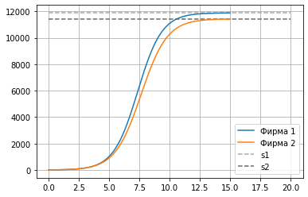
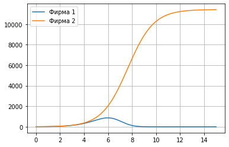
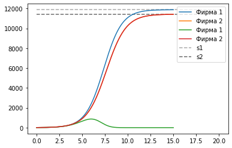

---
## Front matter
lang: ru-RU
title: Лабораторная работа №8 - Модель экономической конкуренции
author: Дидусь К.В.	Группа НКНбд-01-18
date: 3.04.2021

## Formatting
toc: false
slide_level: 2
theme: metropolis
header-includes: 
 - \metroset{progressbar=frametitle,sectionpage=progressbar,numbering=fraction}
 - '\makeatletter'
 - '\beamer@ignorenonframefalse'
 - '\makeatother'
aspectratio: 43
section-titles: true
---

## Прагматика выполнения лабораторной работы

- Модель конкуренции фирм, используется в экономике и позволяет:
	- Вычислить необходимый капитал для входа на рынок
	- Выяснить способность фирмы конкурировать на рынке
	- Найти способы увеличения доходности

## Цель выполнения лабораторной работы

Рассмотреть модель конкуренции двух фирм.

# Задачи выполнения лабораторной работы

## Задачи выполнения лабораторной работы

1. Рассмотреть модель конкуренции фирм в разных случаях.

2. Построить графики изменения оборотных средств и проанализировать их.

# Результаты выполнения лабораторной работы

## Модель конкуренции двух фирм

Математическая модель конкуренции двух фирм описывается системой:

$$ \begin{cases} \frac{\partial M_1}{\partial \theta} = M_1 - \frac{b}{c_1} M_1 M_2 - \frac{a_1}{c_1} M_1^2 \\ \frac{\partial M_2}{\partial \theta} = \frac{c_2}{c_1} M_2 -\frac{b}{c_1} M_1 M_2 - \frac{a_2}{c_1} M_2^2 \end{cases} $$

где

$$ a_1 = \frac{p_{cr}}{\tau_1^2 \tilde{p}_1^2 Nq}, a_2 = \frac{p_{cr}}{\tau_2^2 \tilde{p}_2^2 Nq}, b = \frac{p_{cr}}{\tau_1^2 \tilde{p}_1^2 \tau_2^2 \tilde{p}_2^2 Nq}$$

$$ c_1 = \frac{p_{cr} - \tilde{p}_1}{\tau_1^2 \tilde{p}_1^2}, c_2 = \frac{p_{cr} - \tilde{p}_2}{\tau_2^2 \tilde{p}_2^2} $$

## Начальные условия

$M_0^1 = 7.5$ — оборотные средства фирмы 1

$M_0^2 = 9.5$ — оборотные средства фирмы 2

$p_{cr} = 45$ — критическая стоимость продукта

$N = 55$ — число потребителей производимого продукта

$q = 1$ — максимальная потребность одного человека в продукте в единицу времени

$\tau_1 = 30$ — длительность производственного цикла фирмы 1

$\tau_2 = 25$ — длительность производственного цикла фирмы 2

$\tilde{p}_1 = 9$ — себестоимость продукта фирмы 1

$\tilde{p}_2 = 11$ — себестоимость продукта фирмы 2

# Результаты выполнения

## Результаты выполнения

{ #fig:001 width=70% }

## Результаты выполнения

{ #fig:002 width=70% }

## Результаты выполнения

{ #fig:003 width=70% }

## {.standout}

Рассмотрел модель конкуренции двух фирм в двух случаях и проанализировал отличия.